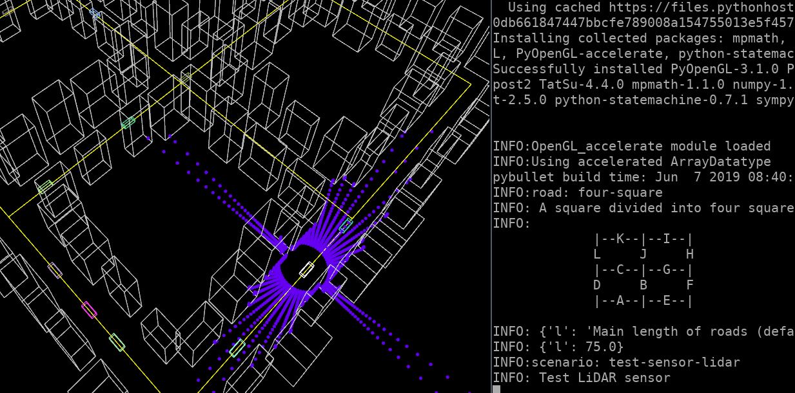

# Daisy
A prototype built to explore simulating dynamic nested parameter spaces for autonomous driving in a model-based manner, at a relatively high level of abstraction. 

The name comes from the analogy that each single parameter instantiation grows multiple petals like a daisy , in which other dynamic parameters are found, ad infinitum. 

# Prerequisites

- Python >= 3.7
- pip
- virtualenv

# Setup Instructions

- cd to ./dev
- sh ./setup_venv.sh
- source ./activate_venv.sh
- pip install -r ./requirements.txt

# Running Instructions
- When starting a development session, enter the venv with
    - source ./dev/activate_venv.sh
- When ending a development session, exit venv with
    - deactivate
    
# Example Scenario
- ./run_scenario.py lidar
- ./run_param_server.py -scenario lidar -flow.frames 300 -flow.headed -flow.samples 12 -flow.threads 6
	- Note that a tiling window manager is recommended, since this will open many windows, and by default they will hide each other

# Scenarios
- Scenarios are found in ./py_scenarios
- The first argument to ./run_scenario is a pattern against which the files in ./py_scenarios are matched

# Documentation
- To generate a class diagram, you can use pyreverse
    - pip install pylint
    - cd to proto3
    - pyreverse ./
    - xdot classes.dot
